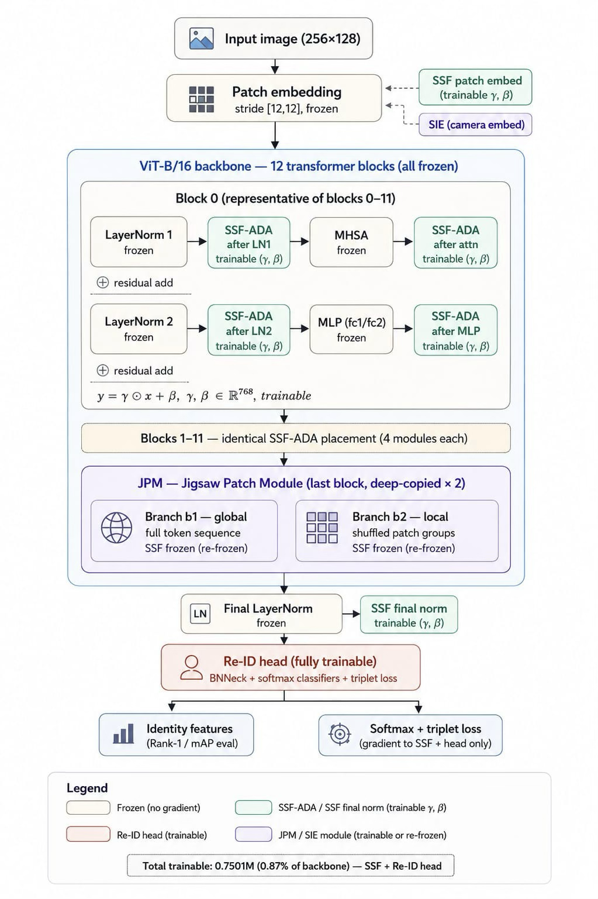

-orange.svg)

# SSF-on-TransReID: Parameter-Efficient Person Re-Identification

This repository implements **Scale-and-Shift Features (SSF)** — the parameter-efficient
fine-tuning (PEFT) method of Lian *et al.* (NeurIPS 2022) — on top of the
[**TransReID**](https://arxiv.org/abs/2102.04378) ViT-Base backbone, and reproduces the
**SSF experiments** reported in our paper:

> **Efficient Person Re-Identification via LoRA and SSF: A Comparative PEFT Study on
> ViT Backbone in TransReID**
> Huzaifa Naseer, Tameema Rehman, Anas Ashfaq, Farrukh Hasan Syed
> *Department of Computer Science, FAST-NUCES, Karachi & IBA Karachi.*

The paper conducts a controlled comparison of two structurally distinct PEFT methods —
**LoRA** (weight-space, low-rank) and **SSF** (activation-space, per-channel affine) — on a
frozen TransReID backbone under the standard Market-1501 protocol. **This repository holds
the SSF phase.** The LoRA phase and the full combined study live in the companion repo:
👉 https://github.com/Huzaifa9559/PEFT-on-Transreid.git

> **Base code.** Forked from the official
> [TransReID](https://github.com/damo-cv/TransReID) implementation. The backbone,
> Side-Information Embedding (SIE), Jigsaw Patch Module (JPM), Re-ID head, data pipeline,
> and evaluation protocol are **unchanged**; the only additions are the SSF PEFT modules and
> the config/optimizer plumbing that drive them (see [Changes We Made](#changes-we-made)).

---

## Table of Contents
- [Motivation](#motivation)
- [Method: SSF in a Nutshell](#method-ssf-in-a-nutshell)
- [Changes We Made](#changes-we-made)
- [Configuration Space](#configuration-space)
- [Results on Market-1501](#results-on-market-1501)
- [Installation](#installation)
- [Prepare Data & Pretrained ViT](#prepare-data--pretrained-vit)
- [Training SSF](#training-ssf)
- [Evaluation](#evaluation)
- [Verification & Sanity Tools](#verification--sanity-tools)
- [Repository Layout](#repository-layout)
- [Citation](#citation)
- [Acknowledgement](#acknowledgement)

---

## Motivation

Full fine-tuning of a ViT-based Re-ID model such as TransReID is strong but expensive in
memory and compute, and each new camera domain requires storing a full backbone copy. **PEFT**
freezes the backbone and trains only a small task-specific set of parameters. SSF is an
attractive PEFT choice because it:

- learns only per-channel **scale** (`γ`) and **shift** (`β`) vectors applied to activations —
  a **compact footprint (≈2.87 % of backbone parameters)** for full 0–11 block coverage;
- can be **reparameterized into the preceding linear layer at inference**, adding
  **zero extra FLOPs** at deployment;
- is **rank-independent** and structurally different from LoRA, making it the ideal second
  paradigm for a controlled PEFT comparison.

---

## Method: SSF in a Nutshell

For a tensor `x` whose last dimension is the channel size `C`, SSF computes an element-wise
affine transform:

```
SSF(x) = γ ⊙ x + β        γ, β ∈ R^C
```

`γ` is initialized to **ones** and `β` to **zeros**, so every SSF module starts as an
**identity** — pretrained TransReID behavior is preserved exactly until optimization moves the
parameters. With the backbone frozen, only these `γ`/`β` vectors (plus the standard Re-ID head)
are trainable.

<p align="center">
  
</p>
<p align="center">
  <em>SSF pipeline on TransReID. The ViT-B/16 backbone (all 12 blocks), patch embedding, JPM,
  and final LayerNorm are frozen; only the SSF-ADA scale-and-shift vectors (γ, β) and the Re-ID
  head are trainable. Each block carries four SSF-ADA modules (after LN1, attention, LN2, MLP),
  plus global SSF at patch embedding and final norm.</em>
</p>

**SSF-ADA placement.** Within each adapted transformer block, SSF is inserted after **four**
operation types — matching the SSF paper's full four-point recipe:

| Site | Position in forward | Adapts |
|------|---------------------|--------|
| `ssf_norm1` | after LayerNorm-1, before attention | normalized input to MHSA |
| `ssf_attn`  | after attention output, before residual add | relational output of MHSA |
| `ssf_norm2` | after LayerNorm-2, before MLP | normalized input to FFN |
| `ssf_mlp`   | after MLP output, before residual add | non-linear output of FFN |

Two **global** SSF modules are also added: `ssf_patch_embed` (right after patch projection) and
`ssf_final_norm` (after the final LayerNorm, before CLS readout).

---

## Changes We Made

All changes are additive and **config-driven** — with `PEFT.SSF.ENABLED: False`, the code
behaves as vanilla TransReID. Full detail lives in
[`SSF_ON_TRANSREID_IMPLEMENTATION.md`](SSF_ON_TRANSREID_IMPLEMENTATION.md).

| File | What we added | Why |
|------|---------------|-----|
| [`model/peft/ssf.py`](model/peft/ssf.py) | Reusable `SSF` `nn.Module` (identity-init `γ`/`β`) + `merge_ssf_into_linear` / `unmerge_ssf_from_linear` helpers for zero-FLOP inference reparameterization. | Core module. |
| [`model/backbones/vit_pytorch.py`](model/backbones/vit_pytorch.py) | `Block` gains four SSF sites; `TransReID` gains `ssf_patch_embed` / `ssf_final_norm`; factories forward `ssf_enabled` / `ssf_blocks`. Selective-block masking via `ssf_blocks`. | Places SSF-ADA across the depth. |
| [`model/make_model.py`](model/make_model.py) | `_freeze_non_ssf()` freezes every parameter without `'ssf'` in its name; correct freeze **order** around the JPM `deepcopy` so duplicated branches (`b1`/`b2`) never leave backbone weights trainable. | Enforces the PEFT freeze recipe, incl. the JPM edge case. |
| [`config/defaults.py`](config/defaults.py) | New `PEFT.SSF` config group: `ENABLED`, `BLOCKS`, `LR`, `FREEZE_BACKBONE`, `MERGE_ON_SAVE`. | Toggle SSF entirely from YAML. |
| [`solver/make_optimizer.py`](solver/make_optimizer.py) | SSF params get **10× BASE_LR** (or explicit `PEFT.SSF.LR`) and **zero weight decay**; AdamW built **without** global `lr`/`weight_decay` so per-group settings survive. | Matches SSF's higher-LR / no-decay recipe without breaking AdamW param groups. |
| [`tests/`](tests/), [`tools/`](tools/) | Pytest integration suite + CLI sanity checkers. | Validate registration, freezing, gradients, identity init, and merge/unmerge. |

---

## Configuration Space

SSF has **no rank hyperparameter**. We sweep two axes (paper §3.5):

- **Depth (block coverage)** — same three regimes as the LoRA phase, set via `PEFT.SSF.BLOCKS`:
  - `0–11` — full depth (`BLOCKS: ()`), all 12 blocks
  - `4–11` — mid + late (`BLOCKS: (4,5,6,7,8,9,10,11)`)
  - `6–11` — late only (`BLOCKS: (6,7,8,9,10,11)`)
- **Optimizer configuration** — to control for the optimizer confound:
  - **Case 1** — LoRA-matched recipe: AdamW, `BASE_LR = 3.0e-4`, `WEIGHT_DECAY = 0.05` (for fair cross-method comparison)
  - **Case 2** — SSF paper official settings: AdamW, `BASE_LR = 3.5e-4`, `WEIGHT_DECAY = 1e-4`, `BIAS_LR_FACTOR = 2`

Fixed training recipe across all runs: **60 epochs**, AdamW, linear warm-up + cosine decay,
Market-1501 pipeline (256×128, random flip, random erasing, color jitter, ImageNet norm),
single NVIDIA RTX 4000 Ada (20 GB). Seeds held constant to reduce variance.

---

## Results on Market-1501

**Baseline (full fine-tuning):** mAP = **88.0 %**, Rank-1 = **94.4 %**, peak VRAM ≈ **11.5 GB**.

**SSF (this repo)** — accuracy, memory, and trainable-parameter ratio:

| Blocks | Case | mAP | Rank-1 | Rank-5 | GPU (GB) | Params (%) |
|:------:|:----:|:---:|:------:|:------:|:--------:|:----------:|
| Baseline (Full FT) | — | 88.0 | 94.4 | 98.2 | 11.5 | 100 % |
| **0–11** | 1 | 79.7 | 91.0 | 96.9 | 10.1 | 2.87 % |
| **0–11** | 2 | **79.9** | **91.1** | 97.1 | 10.0 | 2.83 % |
| 4–11 | 1 | 74.1 | 88.0 | 95.7 | 9.43 | 2.85 % |
| 4–11 | 2 | 74.5 | 88.0 | 95.8 | 9.45 | 2.85 % |
| 6–11 | 1 | 68.5 | 84.3 | 94.4 | 9.18 | 2.83 % |
| 6–11 | 2 | 68.9 | 84.7 | 94.6 | 9.25 | 2.83 % |

**Key findings (SSF).**
- **Full block coverage (0–11) is essential for SSF** — accuracy drops steeply under partial
  coverage (a larger degradation than LoRA shows), suggesting SSF's feature-space modulation
  relies more heavily on early-block representations.
- **Optimizer choice is marginal** on Market-1501 (Case 1 vs. Case 2 differ by ≤ 0.4 % mAP),
  though Case 2 is consistently a touch better.
- **Parameter efficiency ≠ memory efficiency.** Despite training only ≈2.83–2.87 % of
  parameters, peak VRAM does not drop proportionally — training memory is dominated by
  **intermediate activations retained for backpropagation**, not by trainable parameter count.

**How SSF compares to LoRA (from the paper).** LoRA at **blocks 4–11 (r=32, α=64)** gives the
best accuracy–memory compromise (mAP ≈ 83.2 %, ≈25–30 % VRAM reduction), recovering more of the
full-FT accuracy than SSF. SSF's advantage is its **ultra-compact, zero-inference-overhead**
footprint — attractive when parameter storage/communication dominates (federated or multi-task
sharing). The two methods are **complementary**: LoRA when accuracy recovery is paramount,
SSF when parameter budget dominates. See the paper and the
[companion LoRA repo](https://github.com/Huzaifa9559/PEFT-on-Transreid.git) for the full study.

---

## Installation

```bash
pip install -r requirements.txt
# Reference environment: torch 1.6.0, torchvision 0.7.0, timm 0.3.2, CUDA 10.1.
# torch.cuda.amp is used to accelerate training and requires PyTorch >= 1.6.
```

## Prepare Data & Pretrained ViT

Download **Market-1501** and unzip under `data/`:

```
data
└── market1501
    └── images ..
```

Download the ImageNet-pretrained
[ViT-Base](https://github.com/rwightman/pytorch-image-models/releases/download/v0.1-vitjx/jx_vit_base_p16_224-80ecf9dd.pth)
checkpoint and point `MODEL.PRETRAIN_PATH` at it in the config.

> Update `DATASETS.ROOT_DIR`, `MODEL.PRETRAIN_PATH`, and `OUTPUT_DIR` in the YAML for your
> machine (the shipped SSF configs contain example Windows paths).

## Training SSF

SSF is enabled entirely through the config. Two example configs are provided:

```bash
# SSF on Market-1501 — AdamW, paper-aligned recipe, all 12 blocks (recommended)
python train.py --config_file configs/Market/vit_transreid_stride_ssf_new.yml MODEL.DEVICE_ID "('0')"

# SSF on Market-1501 — SGD variant
python train.py --config_file configs/Market/vit_transreid_ssf.yml MODEL.DEVICE_ID "('0')"
```

**Reproduce a specific depth/optimizer cell** by overriding on the command line, e.g. the
4–11 regime under Case 2:

```bash
python train.py --config_file configs/Market/vit_transreid_stride_ssf_new.yml \
  MODEL.DEVICE_ID "('0')" \
  PEFT.SSF.BLOCKS "(4,5,6,7,8,9,10,11)" \
  SOLVER.BASE_LR 3.5e-4 SOLVER.WEIGHT_DECAY 1e-4 SOLVER.BIAS_LR_FACTOR 2
```

**`PEFT.SSF` config knobs:**

| Key | Default | Meaning |
|-----|---------|---------|
| `ENABLED` | `False` | Master switch for SSF in the ViT backbone. |
| `BLOCKS` | `()` | Empty = **all** 12 blocks; a tuple = only those block indices receive SSF-ADA. |
| `LR` | `0.0` | `0.0` → use **10× `SOLVER.BASE_LR`** for SSF params; else this explicit LR. |
| `FREEZE_BACKBONE` | `False` | With `ENABLED`, freezes all non-SSF params (incl. JPM `b1`/`b2`). |
| `MERGE_ON_SAVE` | `False` | Reserved; merge helpers live in `model/peft/ssf.py` for manual/future use. |

## Evaluation

```bash
python test.py --config_file configs/Market/vit_transreid_stride_ssf_new.yml \
  MODEL.DEVICE_ID "('0')" TEST.WEIGHT '<path/to/checkpoint.pth>'
```

Reports **mAP** and **CMC Rank-1/5/10** under the single-query Market-1501 protocol.

## Verification & Sanity Tools

```bash
# Pytest integration suite: registration, selective blocks, gradients, identity-init,
# optimizer param groups, merge/unmerge helpers.
pytest tests/test_ssf_integration.py

# Load a YAML and print SSF parameter counts/names, or run a tiny CPU forward/backward.
python tools/check_ssf.py --config_file configs/Market/vit_transreid_stride_ssf_new.yml
python tools/check_ssf.py --cpu-only

# Compare baseline vs. SSF loss curves on a tiny synthetic model (smoke test).
python tools/short_train.py
```

---

## Repository Layout

Files that are **new or modified** for SSF (everything else is stock TransReID):

```
model/peft/ssf.py                 SSF module + merge/unmerge helpers
model/peft/__init__.py            PEFT package exports
model/backbones/vit_pytorch.py    SSF-ADA placement in Block + TransReID; factory args
model/make_model.py               _freeze_non_ssf; JPM deepcopy + freeze order
config/defaults.py                PEFT.SSF config group
solver/make_optimizer.py          SSF LR multiplier, zero WD, AdamW param-group fix
configs/Market/vit_transreid_stride_ssf_new.yml   AdamW / paper-aligned SSF config
configs/Market/vit_transreid_ssf.yml              SGD SSF config
tests/test_ssf_integration.py     Automated SSF tests
tools/check_ssf.py                CLI SSF sanity check
tools/short_train.py              Tiny-model training sanity check
SSF_ON_TRANSREID_IMPLEMENTATION.md  Detailed implementation notes
```

---

## Citation

If you use this code or the SSF study, please cite our paper and the original TransReID:

```bibtex
@article{naseer2025peft_transreid,
  title   = {Efficient Person Re-Identification via LoRA and SSF: A Comparative PEFT
             Study on ViT Backbone in TransReID},
  author  = {Naseer, Huzaifa and Rehman, Tameema and Ashfaq, Anas and Syed, Farrukh Hasan},
  year    = {2025}
}

@inproceedings{He_2021_ICCV,
  author    = {He, Shuting and Luo, Hao and Wang, Pichao and Wang, Fan and Li, Hao and Jiang, Wei},
  title     = {TransReID: Transformer-Based Object Re-Identification},
  booktitle = {Proceedings of the IEEE/CVF International Conference on Computer Vision (ICCV)},
  year      = {2021},
  pages     = {15013--15022}
}

@inproceedings{lian2022ssf,
  author    = {Lian, Dongze and Zhou, Daquan and Feng, Jiashi and Wang, Xinchao},
  title     = {Scaling \& Shifting Your Features: A New Baseline for Efficient Model Tuning},
  booktitle = {Advances in Neural Information Processing Systems (NeurIPS)},
  year      = {2022}
}
```

## Acknowledgement

Built on the official [TransReID](https://github.com/damo-cv/TransReID) codebase, which in turn
draws from [reid-strong-baseline](https://github.com/michuanhaohao/reid-strong-baseline) and
[pytorch-image-models](https://github.com/rwightman/pytorch-image-models). The SSF method is due
to Lian *et al.* (NeurIPS 2022). Companion LoRA phase:
[PEFT-on-Transreid](https://github.com/Huzaifa9559/PEFT-on-Transreid.git).
